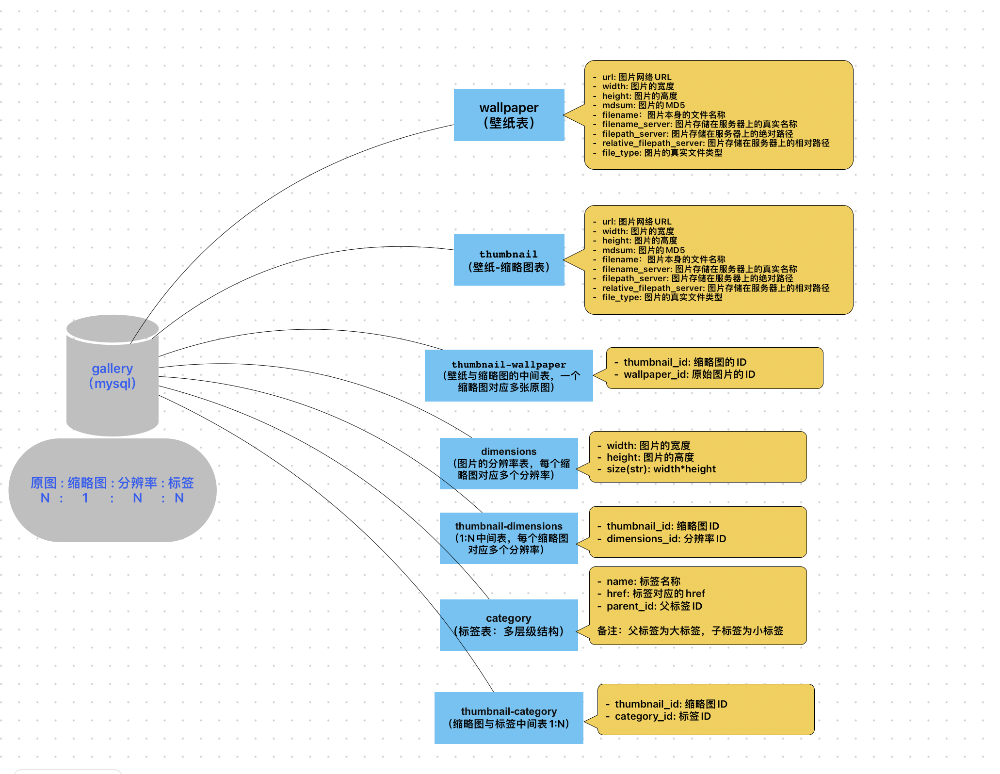

# 个人学习站点

### 数据库自动化
使用Flyway进行数据库表的自动创建以及数据的初始化

### 数据库架构设计

### 壁纸网站来源
* [WallHere](https://wallhere.com/zh/wallpapers?order=popular&format=json)
* [3g壁纸](https://www.3gbizhi.com/)
* [极简壁纸](https://bz.zzzmh.cn/index)
* [电脑壁纸](https://wallpaper.ur1.fun/)
* [WallpapersCraft](https://wallpaperscraft.com/)
* [Wallpaper Cave](https://wallpapercave.com/)

### 文档资料

* [Flyway如何使用](https://blog.csdn.net/Jiao1225/article/details/129590660)
* [Cloudflare如何绕过](https://blog.csdn.net/LBWNB_Java/article/details/126008642)

